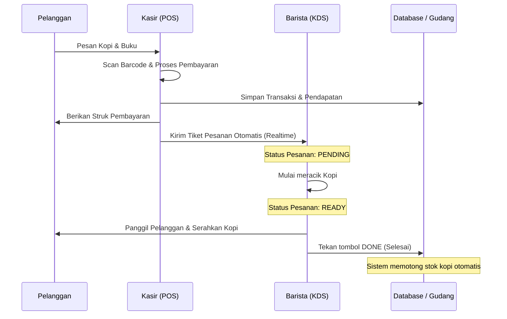
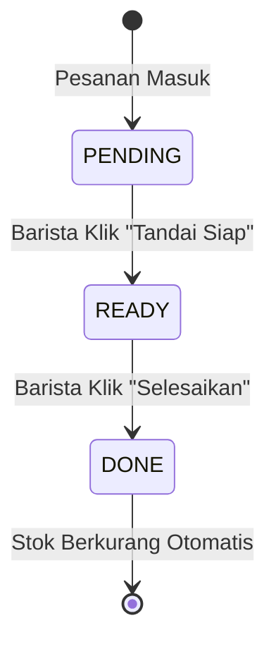

# BUKU PANDUAN PENGGUNAAN (USER MANUAL)
## MAKARYA ERP v2.0 - Sistem Manajemen Terpadu Toko Buku & Coffee Shop

---

**KONTROL DOKUMEN**
| Versi | Tanggal Efektif | Dibuat Oleh | Status | Deskripsi Perubahan |
|---|---|---|---|---|
| 2.0 | 10 Juni 2026 | Tim Pengembang Makarya | **APPROVED** | Rilis panduan standar operasional (SOP) terpadu. |

---

## DAFTAR ISI
1. [BAB I: ALUR KERJA OPERASIONAL (WORKFLOW)](#bab-i-alur-kerja-operasional-workflow)
2. [BAB II: SOP KASIR (POINT OF SALE)](#bab-ii-sop-kasir-point-of-sale)
3. [BAB III: SOP BARISTA (KITCHEN DISPLAY SYSTEM)](#bab-iii-sop-barista-kitchen-display-system)
4. [BAB IV: SOP GUDANG & INVENTARIS](#bab-iv-sop-gudang--inventaris)
5. [BAB V: PANDUAN MANAJERIAL (DASHBOARD & LAPORAN)](#bab-v-panduan-manajerial-dashboard--laporan)
6. [BAB VI: PEMECAHAN MASALAH (TROUBLESHOOTING)](#bab-vi-pemecahan-masalah-troubleshooting)

---

 

## BAB I: ALUR KERJA OPERASIONAL (WORKFLOW)

Untuk memahami bagaimana aplikasi ini bekerja secara keseluruhan, berikut adalah bagan alur pesanan dari pelanggan datang hingga pesanan selesai.

---

 

## BAB II: SOP KASIR (POINT OF SALE)

Layar Kasir (POS) adalah ujung tombak operasional. Pastikan tablet Kasir selalu terhubung ke internet dan *Printer Thermal* dalam keadaan menyala.

### 2.1 Membuka Sesi Kasir
1. Buka aplikasi Makarya ERP.
2. Masukkan **Employee ID** dan **Password**.
3. Sistem akan memuat layar **Point of Sale** yang terdiri dari *Katalog Menu* di sebelah kiri dan *Panel Keranjang* di sebelah kanan.

### 2.2 Skenario A: Transaksi Normal (Food & Beverage)
**Tujuan:** Memproses pesanan minuman atau makanan biasa.
1. Arahkan pelanggan untuk melihat menu.
2. Di **Katalog Menu**, tap kategori **COFFEE** atau **FOOD**.
3. Tap pada *card* produk yang dipilih (misal: *Signature Espresso*). 
   - *Indikator Keberhasilan:* Muncul animasi *fly-to-cart* dan item bertambah di panel keranjang sebelah kanan.
4. Di panel keranjang, sesuaikan jumlah pesanan dengan menekan tombol `+` atau `-`.
5. Klik tombol hijau **Proses Pembayaran** di sudut kanan bawah.
6. Pilih metode pembayaran. Jika tunai (`CASH`), masukkan uang yang diterima dan serahkan uang kembalian.
7. Klik **Selesaikan**. Laci kasir akan terbuka dan struk otomatis tercetak.

### 2.3 Skenario B: Pembelian Buku menggunakan Barcode Scanner
**Tujuan:** Memproses barang ritel fisik dengan cepat dan akurat.
> [!TIP]
> Fitur ini sangat mengurangi risiko *human error* karena salah pilih judul buku di katalog.

1. Klik tombol berikon **Kamera/Barcode** di atas layar katalog.
2. Arahkan lensa kamera ke *barcode* ISBN di sampul belakang buku pelanggan.
3. Setelah bunyi *beep* terdengar, buku akan langsung masuk ke keranjang. Lanjutkan ke proses pembayaran seperti biasa.

### 2.4 Skenario C: Penerapan Promo Bundle (Buku + Kopi)
**Tujuan:** Menerapkan diskon strategi *cross-selling* otomatis.
1. Kasir **tidak perlu** memasukkan kode diskon manual.
2. Cukup masukkan minimal 1 produk kopi dan 1 produk buku ke dalam keranjang secara bersamaan.
3. **Hasil Otomatis:** Sistem akan memunculkan *badge* emas **"Book + Coffee 10% — Diskon 10%"** dan memotong harga dasar secara otomatis. Beritahukan pelanggan bahwa mereka berhak mendapat diskon *bundling*.

---

 

## BAB III: SOP BARISTA (KITCHEN DISPLAY SYSTEM)

Sistem *Kitchen Display System* (KDS) menggantikan peran tiket cetak berbahan kertas yang sering hilang di dapur.

### 3.1 Membaca Tiket Pesanan
Layar Barista memunculkan kotak pesanan (tiket) setiap kali Kasir menyelesaikan pembayaran.
- **Kiri Atas:** Nomor pesanan (misal: `TRX-101`).
- **Tengah:** Daftar jenis minuman dan catatan khusus pelanggan (contoh: *Less Sugar*).
- **Kanan Atas:** Waktu tunggu (*Timer*).

### 3.2 Menangani Status Pesanan (Wajib Dipatuhi)
> [!WARNING]
> Sangat dilarang untuk menekan tombol **Selesai (DONE)** jika minuman belum benar-benar diracik dan diserahkan! Tombol ini memicu pengurangan stok bahan baku (*auto-deduct*) di server pusat.

- **Langkah 1 (Persiapan):** Barista melihat layar, jika indikator warna masih abu-abu (`PENDING`), segera racik minuman.
- **Langkah 2 (Siap Diambil):** Setelah minuman jadi dan diletakkan di meja pengambilan, tekan tombol kuning **"Tandai Siap (READY)"**.
- **Langkah 3 (Penyerahan):** Panggil nomor pesanan. Jika pelanggan sudah mengambil minumannya, tekan tombol hijau **"Selesaikan (DONE)"**. Tiket akan hilang dari layar.

### 3.3 Penanganan Pesanan Telat (Urgent)
Jika *Timer* pada tiket melebihi **10 menit**, tiket akan **berubah warna menjadi MERAH**. Barista harus segera menghentikan aktivitas lain dan memprioritaskan pembuatan minuman ini.

---

 

## BAB IV: SOP GUDANG & INVENTARIS

### 4.1 Pemantauan Status Umur Barang (Inventory Aging)
Staf gudang (Stock Keeper) wajib membuka layar **Inventory** setiap awal *shift* (pagi hari).
> [!IMPORTANT]
> Aturan Masa Kedaluwarsa: Kopi yang dipanggang (roasting) memiliki batas kelayakan (*shelf-life*). Sistem Makarya menyetel batas kedaluwarsa kopi pada angka 14 hari sejak restock.

Sistem memberikan indikator warna pada setiap barang:
- 🟢 **HIJAU:** Aman (Healthy).
- 🟡 **KUNING:** Peringatan. Barang hampir habis (Low Stock) atau buku sudah lama tidak laku > 30 hari (Slow Mover).
- 🔴 **MERAH:** Kritis. Stok habis sama sekali, atau biji kopi sudah berumur lebih dari 14 hari (Basi).

### 4.2 Prosedur Pencatatan Barang Rusak / Terbuang (Wastage)
Bahan yang terbuang karena kecelakaan kerja adalah hal yang lumrah, namun harus dicatat agar *Net Profit* hari tersebut disesuaikan.
1. Di layar Inventory, klik tombol **Catat Wastage**.
2. Pilih barang yang terbuang (contoh: *Susu Oat*).
3. Masukkan Kuantitas yang tumpah (contoh: *1 kotak*).
4. Pilih Alasan Pembuangan:
   - `SPILLED`: Tumpah karena kelalaian.
   - `QUALITY_REJECT`: Basi atau rasa tidak enak.
   - `DAMAGED`: Kemasan rusak dari suplier.
5. Tekan **Simpan**. Sistem akan memotong laba toko secara otomatis.

---

 

## BAB V: PANDUAN MANAJERIAL (DASHBOARD & LAPORAN)

Modul ini dirancang khusus untuk Manajer / Owner untuk melakukan pengambilan keputusan bisnis yang cerdas.

### 5.1 Matriks Laba Bersih Harian (Net Profit)
Formula yang dianut oleh sistem ERP ini bukan sekadar uang masuk, melainkan Laba Akurat.
> [!NOTE]
> Rumus Paten Makarya ERP: 
> **Laba Bersih** = (Pendapatan Kotor - Diskon) - Harga Pokok Penjualan (HPP) - Biaya Operasional (OPEX) - Nilai Barang Terbuang (Wastage).

Di layar Dashboard Utama, selalu perhatikan kartu **Net Margin**. Jika persentase di atas 18% (warna Hijau), toko Anda beroperasi dengan sangat sehat hari itu.

### 5.2 Mencatat Biaya Operasional Harian (OPEX)
Agar rumus *Net Profit* di atas valid, Manajer **Wajib** mencatat pengeluaran uang laci setiap harinya.
1. Buka menu **Expenses**.
2. Klik **Tambah Pengeluaran**.
3. Jika Anda mengeluarkan uang kasir untuk membeli galon air atau tisu, masukkan nominalnya dan pilih kategori `SUPPLIES`.

### 5.3 Ekspor & Distribusi Laporan Keuangan Akhir Bulan
Anda tidak perlu lagi menyusun Excel secara manual.
1. Masuk ke menu **Financial Report / Analytics**.
2. Di layar ini, tekan tombol bergambar **PDF** di pojok kanan atas layar.
3. Aplikasi akan men- *generate* laporan P&L (Profit & Loss), Tren Revenue 30 Hari, dan *SKU Profitability Matrix* menjadi dokumen PDF dengan *kop surat* berstandar profesional.
4. Gunakan fitur *Share* bawaan sistem operasi untuk mengirim file tersebut langsung ke *Group* WhatsApp direksi.

---

 

## BAB VI: PEMECAHAN MASALAH (TROUBLESHOOTING)

### 6.1 Printer Struk Tidak Merespon
1. **Periksa Daya & Kertas:** Pastikan lampu indikator *Thermal Printer* menyala dan arah gulungan kertas tidak terbalik.
2. **Periksa Jaringan Lokal:** Printer dan Tablet Kasir *harus* berada dalam satu jaringan Wi-Fi (SSID) yang sama.
3. **Cetak Ulang (Reprint):** Jika mesin baru saja dinyalakan, Anda tidak perlu mengulang pesanan. Masuk ke Riwayat Transaksi (History), klik nomor transaksi terakhir, lalu tekan tombol **Cetak Ulang Struk**.

### 6.2 Data Barista Queue Tidak Update
Jika Kasir sudah *checkout* pesanan namun layar Barista kosong:
1. Pastikan tablet Barista terhubung ke internet (karena menggunakan protokol *Websocket Supabase*).
2. Jika internet mati sesaat, tekan tombol abu-abu **Refresh (Sinkronisasi Manual)** di pojok kanan atas layar KDS agar sistem menarik data pesanan paksa dari server utama.

### 6.3 Barcode Buku Tidak Ditemukan
Jika kamera kasir berhasil membaca *barcode* tapi sistem mengatakan "Produk tidak ditemukan":
1. Pastikan staf Gudang sudah menambahkan buku tersebut ke *database Master Data*.
2. Pastikan nomor ISBN yang dimasukkan di *database* sama persis (tanpa spasi/tanda hubung) dengan yang tertera di stiker fisik buku.

---
*(Dokumen Terkendali - Makarya ERP 2026)*
